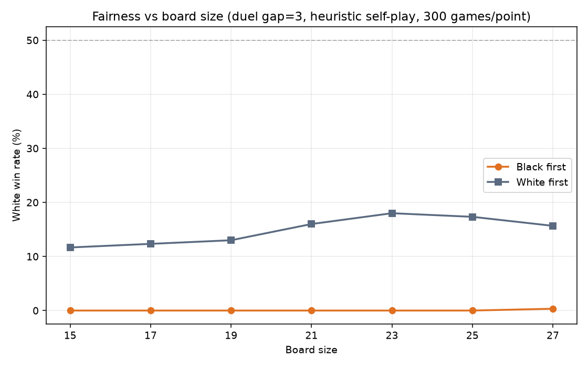
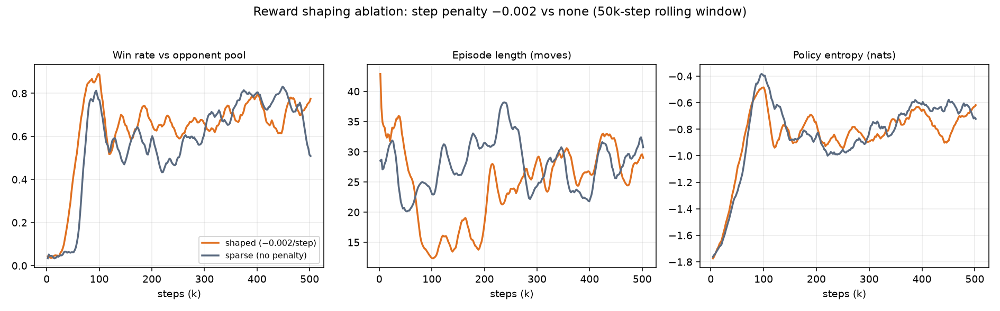
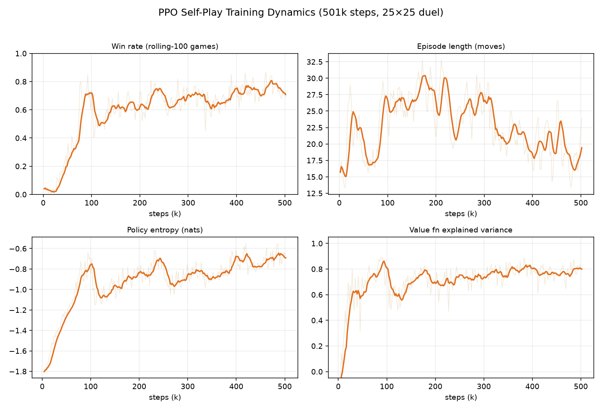
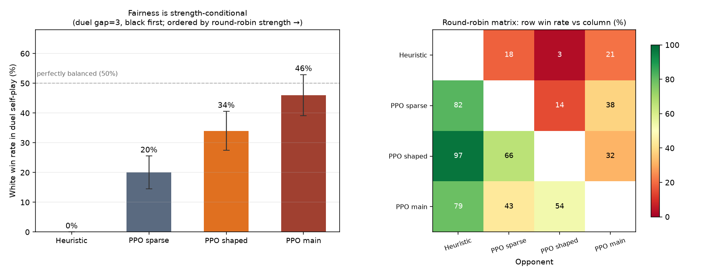

# Quantifying Rule Fairness in a Self-Modifying Board Game via Self-Play Reinforcement Learning

**A technical report on Terraflux (涌陆), an original pursuit-evasion board game**

*Your Name · August 2026*
*Code: [github.com/ajt071220-netizen/terraflux](https://github.com/ajt071220-netizen/terraflux) · Playable demo: [ajt071220-netizen.github.io/terraflux](https://ajt071220-netizen.github.io/terraflux/)*

<!-- ============================================================
写作总纲（写完请删除所有此类注释块）

目标篇幅：4–5 页 PDF（约 1800 词正文 + 4 图 3 表）。
语气：第一人称、主动语态。这是一份"项目报告"，不是期刊论文——
招生官想看到的是"你"的判断、惊讶、反思。
数字纪律：所有数字已经预填，来自 experiments/REPORT_DATA.md，
【不要手改任何数字】。你要写的是数字之间的叙事。
============================================================ -->

## Abstract

<!-- 【你来写】150 词以内，三段式：
第 1 段（2 句）：我发明了什么游戏 + 它让"规则公平吗"这个问题为什么难答。
第 2 段（2 句）：我怎么把它变成 RL 实验台（PPO 自我对弈 + 三类智能体 + 可玩 3D 模拟器）。
第 3 段（2 句）：三个发现各一句话——①奖励整形加速学习但日志胜率会说谎；②自我对弈胜率震荡是共进化而非崩溃；③公平性是强度条件化的（0%→46% 单调收敛）。
-->

> [Abstract to be written]

## 1. Introduction — The Game and the Question

<!-- 【你来写】约 350–400 词。结构建议：
1) 开头 1 句讲发明动机（为什么想设计一个"地形会动"的棋）。
2) 规则压缩成 5–6 句：25×25 柱阵棋盘；白逃向金色南边线、黑追捕；
   每步落子改写落点周围地形（十字相位：北隆起/南下陷/东西填平；
   斜向相位：东北西北隆起/东南西南下陷）；棋子随柱升降；
   抓捕条件：相邻且黑严格高于白。
3) 核心问题：这套规则公平吗？为什么人工推演回答不了
   （状态空间太大、地形与位置强耦合、人类直觉在动态地形上失效）。
4) 预告：我把游戏变成 RL 实验台，用收敛的策略来给"公平"下操作化定义。
-->

> [Section 1 to be written]

<!-- 上图是占位：建议换成一张网站截图（棋盘+演示解说条），
     截图命名为 report/fig_screenshot.png 并替换上面的路径。
     图注可改为：Figure 1. The playable 3D simulator (Three.js). -->

## 2. Methods — From a Game to an RL Testbed

<!-- 【你来写】约 300–350 词。三个要点（各 1 段）：
1) 系统：游戏引擎用 JS 写一遍、Python 逐行移植一遍（双实现互验），
   前端 Three.js 可玩，后端接入三类智能体（启发式 / PPO / LLM）。
2) 训练：MaskablePPO（带动作掩码）自我对弈，对手池 =
   65% 启发式 + 35% 自身历史快照（最近 5 个），主训练 50 万步；
   观测 = 棋盘多通道张量 + 高度/距离/相位特征；动作 = 8 方向 + 停步；
   奖励 = 终局 ±1（稀疏），实验组加每步 −0.002 步罚。
3) 评估协议：自对弈胜率 + 模型间循环赛，每条件 200–300 局，
   报 95% 置信区间。强调：跨模型强度比较只用循环赛直接对局
   （这条是 Finding 1 的伏笔）。
-->

> [Section 2 to be written]

## 3. Results — Three Findings

### 3.1 Reward shaping speeds learning — and self-play logs lie

两组 MaskablePPO 从零训练，唯一变量为步罚（shaped: −0.002/step；sparse: 0）。
25×25 duel 布局（gap 3、黑先），各 50 万步。

| Metric | Shaped | Sparse |
|---|---|---|
| Steps to rolling win rate 55% | **59k** | 73k (+24% slower) |
| Steps to rolling win rate 65% | **65k** | 77k (+18% slower) |
| Late-stage win rate vs own snapshot pool | 0.716 | 0.709 (looks tied) |
| **Head-to-head round robin** | **66.0%** | 14.5% (19.5% draws) |
| Mean game length (late stage) | 28.8 | 29.2 |

<!-- 【你来写】约 250–300 词。这是全文最好的叙事点，建议按
"被骗 → 醒悟 → 验证"写：
1) 末段日志胜率 0.716 vs 0.709——我当时以为两组最终一样强；
2) 但日志胜率是"各自对自己的快照池"算的，池子强度不同，不可比；
3) 循环赛直接对局：66 : 14.5——sparse 组学到的是"对弱对手苟活"，
   遇到强对手即崩。
4) 一句方法论收束：在自我对弈里，日志胜率是记账单位，不是强度单位。
-->

> [3.1 narrative to be written]

### 3.2 Self-play oscillates — it does not converge, and that is not a bug

主训练 50 万步 rollout 级日志（245 采样点）：

| Phase | Steps | Rolling win rate | Policy entropy | Episode length |
|---|---|---|---|---|
| Early | 2k–165k | 0.419 | −1.119 | 23.1 |
| Mid | 167k–331k | 0.672 | −0.850 | 25.8 |
| Late | 333k–501k | 0.712 | −0.757 | 20.0 |

<!-- 【你来写】约 200–250 词。要点：
1) 胜率从随机水平（≈0）爬到 0.87 区间；中期（150k–400k）持续宽幅震荡；
2) 解释：学习方变强的同时，对手池（自身快照）同步变强——
   相对胜率拉锯是自我对弈的固有动力学，不是训练出错；
3) 佐证：全程无 KL 尖峰（>0.15），仅 2 次熵跳变且与快照注入时刻吻合
   （94k / 104k），属良性适应；值函数解释方差 0.2→0.8 但从未饱和——
   非平稳环境里价值函数永远在追目标。
-->

> [3.2 narrative to be written]

### 3.3 Fairness is strength-conditional

duel 布局（黑镇中央、白正北隔三格、黑先）下，四种强度策略的白胜率：

| Policy | Round-robin rank | White win rate (duel self-play) | Mean length |
|---|---|---|---|
| Heuristic vs itself | 4 (weakest) | **0%** | 10 |
| PPO sparse | 3 | **20%** (95% CI ±5.6%) | 59 |
| PPO shaped | 2 | **34%** (±6.5%) | 75 |
| PPO main (500k steps) | 1 (strongest) | **46%** (±6.9%) | 54 |

<!-- 【你来写】约 300 词。这是全文核心发现，建议结构：
1) 现象：白胜率随策略强度 0% → 20% → 34% → 46% 严格单调，向 50% 收敛；
2) 对照：棋盘尺寸扫描（15×15–27×27，弱策略下全是平线，黑先白胜率≈0%）
   ——尺寸不是公平性变量，强度才是（引 fig_size_fairness.png 一句话带过即可，
   图可放附录或省略）；
3) 机制解释：弱白策略不会"逃"（贪心评估没有保持间距项），黑直线追击
   十步内完成捕捉；只有强策略学会利用地形与间距后，duel 布局才显现平衡；
4) 核心论点：规则公平性不能脱离玩家强度定义；"平衡布局"是一个
   强度依赖的谱，而非布尔属性；用 RL 收敛策略做公平性基准测试，
   是人工推演无法替代的方法论。
-->

> [3.3 narrative to be written]

## 4. Discussion — Limitations and Future Work

<!-- 以下四条来自实验记录，直接用英文改写（每条 1–2 句）即可：
1) 消融为单随机种子；±6% 量级差异需多 seed 复核；
2) "弱策略"由启发式一类代表支撑，结论外推到"所有弱策略"需谨慎；
3) 强策略下的尺寸扫描需每尺寸独立训练模型，受算力所限留作后续；
4) 平衡率测量为 200–300 局，95% CI 约 ±6%。
然后 1–2 句未来工作（多 seed、强策略尺寸扫描、LLM 智能体作为
第三类策略强度样本）。
-->

> [Section 4 to be written]

## 5. References and Links

- **Code & full experiment data**: [github.com/ajt071220-netizen/terraflux](https://github.com/ajt071220-netizen/terraflux)
- **Playable 3D demo (bilingual, with narrated tutorial game)**: [ajt071220-netizen.github.io/terraflux](https://ajt071220-netizen.github.io/terraflux/)
- Schulman, J. et al. (2017). *Proximal Policy Optimization Algorithms*. arXiv:1707.06347.
- Raffin, A. et al. (2021). *Stable-Baselines3: Reliable Reinforcement Learning Implementations*. JMLR 22(268).
- Huang, S. & Ontañón, S. (2022). *A Closer Look at Invalid Action Masking in Policy Gradient Algorithms*. arXiv:2006.14171.
